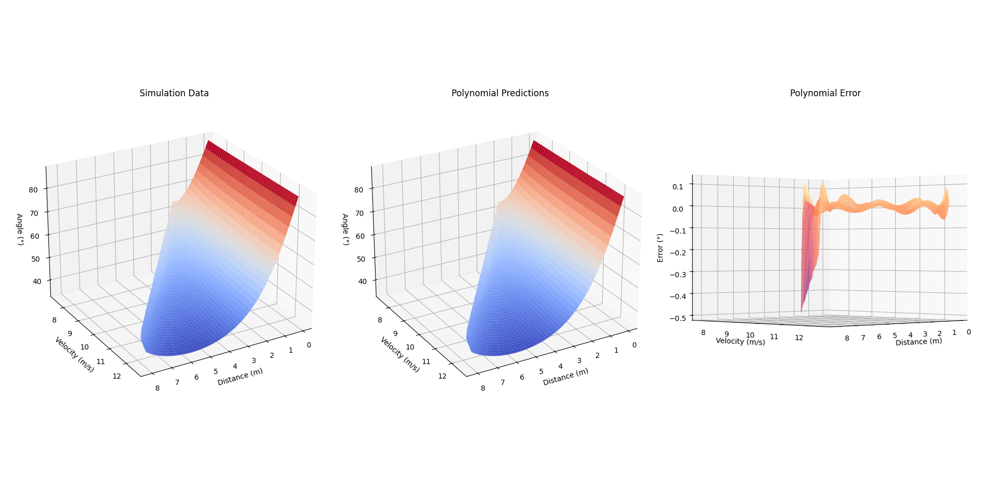

<!-- A centered project overview with the name, description, and an image. -->
<div align = "center">
    <h1 id = "trajectory-simulator">Trajectory Simulator</h1>
    <p>A physics-based program for simulating and fitting bivariate polynomials to FRC game piece trajectories.</p>
    </img>
</div>

## Requirements
* [Rust](https://www.rust-lang.org/tools/install) (1.83.0 or other compatible version).
* [Python](https://www.python.org/downloads/) (3.13.0 or other compatible version).
* [Git](https://git-scm.com/downloads) (to clone the repository, unless you download the [ZIP](https://github.com/cafougner/Trajectory-Simulator/archive/refs/heads/main.zip)).
* Python Dependencies (see below).

First, clone the repository by running:
```sh
git clone clone https://github.com/cafougner/Trajectory-Simulator.git
cd ./Trajectory-Simulator

```

Then, (optionally, activate a Python virtual environment and) install the Python dependencies by running:
```sh
python3 -m pip install -r requirements.txt

```

## Usage
If you want to run the simulation, you can run:
```sh
cargo run --release -- run-simulation

```
which will build and run the Rust crate, generating a simulation [`results.csv`](./results/results.csv) that can be used by the Python scripts. The `--` allows you to pass a command-line argument, and the `run-simulation` is the program mode. Later, there will be a `estimate-coefficients` mode to calculate drag coefficients, but for now it is unimplemented, and if no mode is given the program will panic.

If you want to fit a polynomial to the simulation results, you can run:
```sh
python3 results_equation_generator.py

```
which will fit and write a polynomial to a [`polynomial.txt`](./results/polynomial.txt), along with other information.

If you want to view more detailed information about the polynomial (or just have a cool visual), you can run:
```sh
python3 results_analyzer.py

```
which will fit a polynomial and show it in a Matplotlib window like the one shown [above](#trajectory-simulator).

> [!NOTE]
> The Python scripts are both standalone and just need a properly formatted [`results.csv`](./results/results.csv) in a [`./results`](./results/) folder.

### Configuration
If you don't want to change the behavior of the simulation, just specific values, you can modify the [`constants.rs`](./src/constants.rs). For more invasive configuration of things like the physics, you will probably need to modify the [`integrators`](./src/integrators/).

The [`integrators`](./src/integrators/) are where the main simulation loops are, and where the forces are applied to the velocities (the [`leapfrog.rs`](./src/integrators/leapfrog.rs) integrator is the one currently in use). The [`integrators`](./src/integrators/) use helper functions for initial velocities, aerodynamic forces, etc. from the [`physics_helpers.rs`](./src/integrators/physics_helpers.rs). If you wanted to add something like the Magnus effect to the simulation, you would need to implement a function within the [`physics_helpers.rs`](./src/integrators/physics_helpers.rs), and then modify whichever integrator is in use to apply the force.

> [!IMPORTANT]
> Each of the Python scripts contains their own configurations for paths and the polynomial degree. If you've even read this far, you probably know how to change a number or string in a Python script.
### Robot Integration
* All of this is in theory and has never been tested on a real robot (nor has the math been peer-reviewed). When/if it is implemented, I will write an overview of the implementation and some pseudocode.

## Todo
### Features
* Improve integration error and stopping conditions (see the [`euler.rs`](./src/integrators/euler.rs) TODO comment).
* Support obstacles / indirect trajectories (see the [`euler.rs`](./src/integrators/euler.rs) TODO comment).
* Create a Python script for converting the [`polynomial.txt`](./results/polynomial.txt) into a (Java/CPP/?) function.
* Implement multithreaded CPU and GPU simulations.
<!-- Nothing! It's *perfect*. :shipit: -->

### Known Bugs
* None! The code is *flawless*. :trollface:
